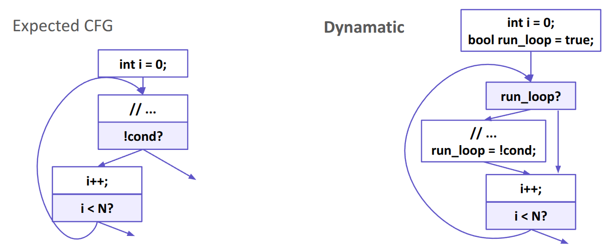

# dynamatic-weird-cfgs

A collection of unusual CFG examples generated by [Dynamatic](https://github.com/EPFL-LAP/dynamatic) (Commit hash: [197367e](https://github.com/EPFL-LAP/dynamatic/tree/197367e1a6a11c1d202fd6bc441d0d3b6bc4c629)).

This repository contains outputs produced by Dynamatic.

## How to Reproduce

To replicate the results in your environment, follow these steps:

```
$ dynamatic
dynamatic> set-src example1/example1.c
dynamatic> compile
```

The output will be available in the example1/out/ folder.

## Example 1

`for` loop with `break` statement.

```c
  for (int i = 0; i < N; i++) {
    int temp = a[i];
    b[i] = temp;
    if (temp < 2) {
      break;
    }
  }
```



Decompiled code for the Dynamatic CFG:

```c
bool run_loop = true;
for (int i = 0; i < N; i++) {
  if (run_loop) {
    int temp = a[i];
    b[i] = temp;
    run_loop = !(temp < 2);
  }
}
```

## Example 2

Normal `do-while` loop.

```c
int example2(in_int_t a[N]) {
  int i = 0;
  int sum = 0;
  do {
    sum += a[i];
    i++;
  } while (sum < 100);
  return sum;
}
```


